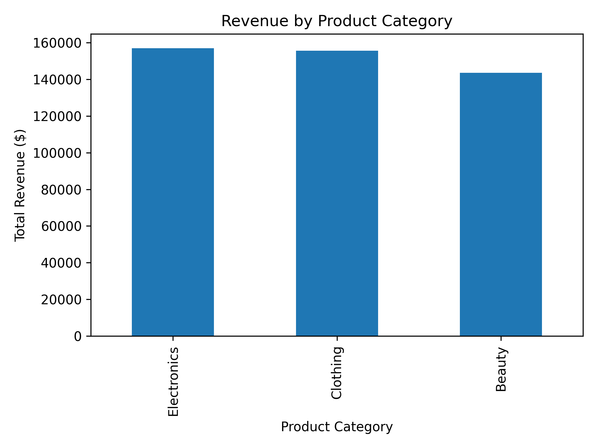
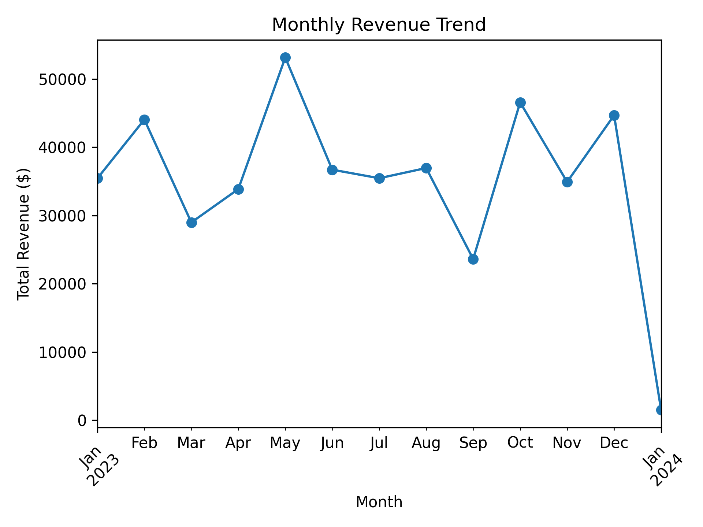
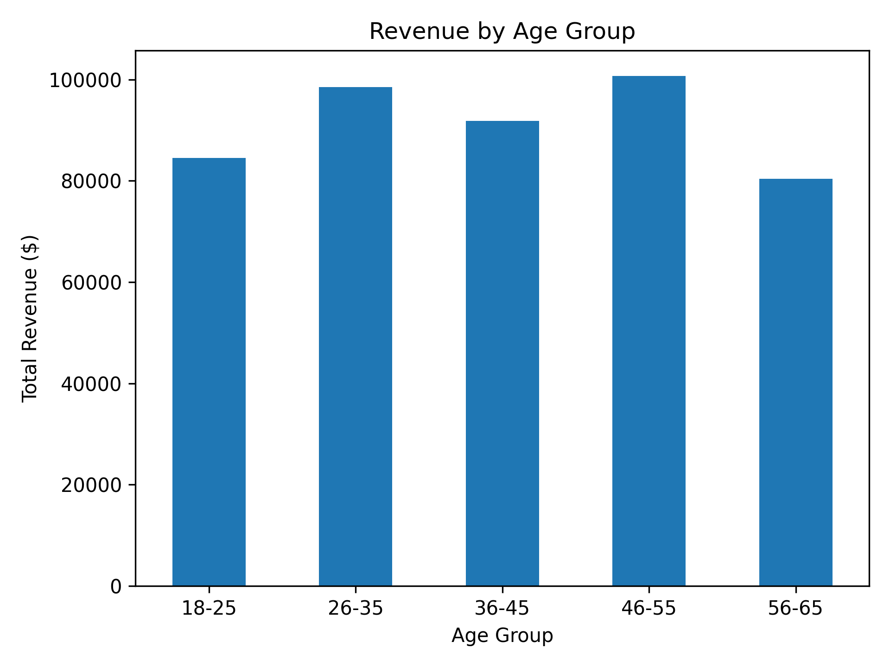
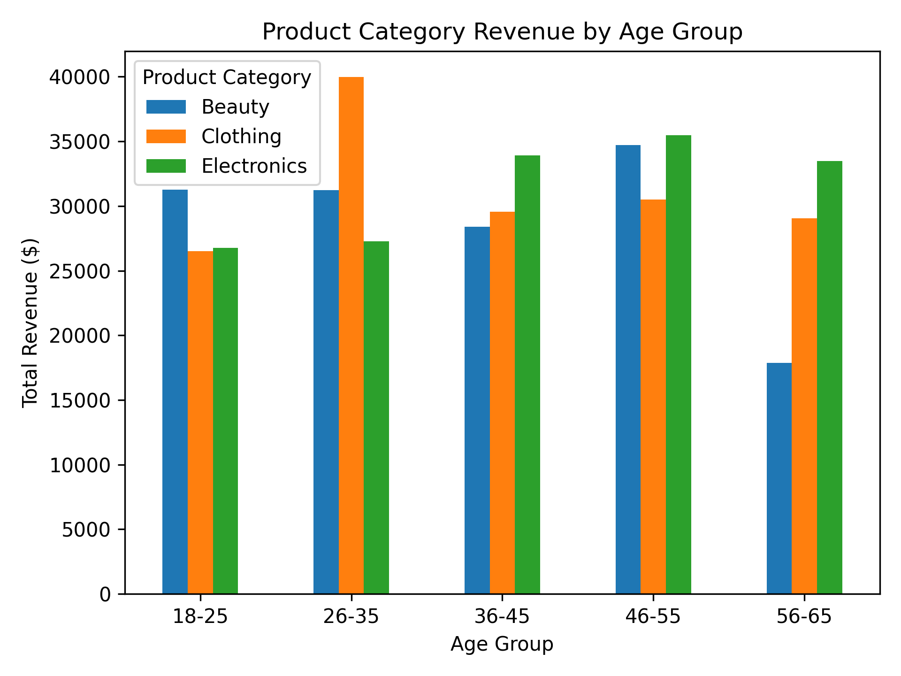

# Retail-Sales-Data

## Project Overview

This project analyses a retail sales dataset to identify key sales trends and customer purchasing patterns.

The analysis explores:
- Revenue across different product categories
- Monthly sales trends
- Customer spending by age group
- Customer spending by gender
- Product preferences across different age groups

The goal of the project is to use Python and data visualisation to turn raw retail transaction data into meaningful business insights.

## Skills & Technologies

- Python
- Pandas
- Matplotlib
- Data Cleaning
- Exploratory Data Analysis (EDA)
- Data Visualisation
- Customer Segmentation

## Key Findings

- Electronics generated the highest overall revenue at $156,905.
- Clothing generated $155,580 in revenue, followed by Beauty at $143,515.
- The 46–55 age group generated the highest revenue at $100,690.
- The 26–35 age group was the second highest-spending age group at $98,480.
- Female customers generated slightly more revenue ($232,840) than male customers ($223,160).
- Monthly revenue fluctuated throughout the year, with May recording the highest sales.
- Product preferences varied across age groups, highlighting differences in purchasing behaviour between customer segments.

## Visualisations

### Revenue by Product Category

### Monthly Revenue Trend

### Revenue by Age Group

### Product Preferences by Age Group
